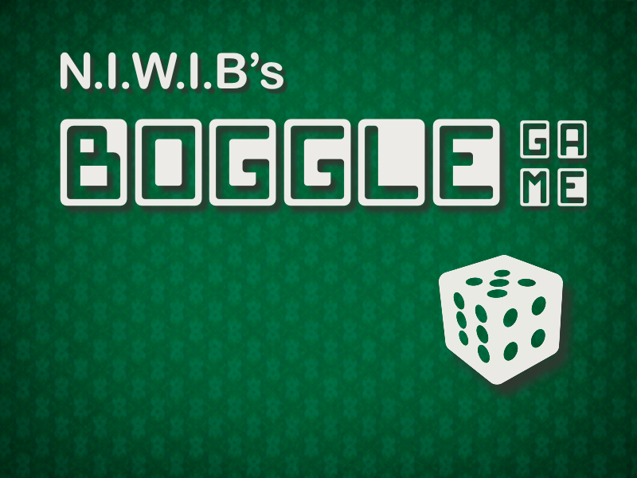

# 🎲 Boggle: JAVA Edition!

A new twist on an old classic! NWIB studios aims to deliver all the fun of classic Boggle in a purely Java based digital environment.

Players can choose between singleplayer and multiplayer, but we also offer a new PVC mode for those lonely nights. Don't think it'll go easy on you! Our AI solves the entire board at lighting speed, but it'll give you chance on you when you adjust it in the settings 😁 

We hope you enjoy, and have a bogglin' good time!

Check out the [Demo](https://www.youtube.com/watch?v=VZ8jEPalEM8)!
